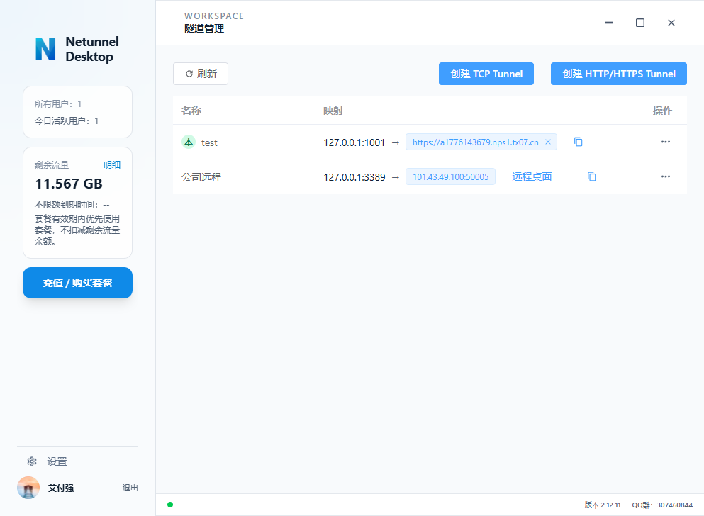

# Netunnel

内网穿透，0.5 元/GB，1 元起用。

每次用内网穿透软件，总会遇到各种限制，而且还贵，于是决定自己做一个。

## 适合谁

- 需要从外网访问本地开发环境的开发者
- 需要把本地 Web 服务临时暴露给同事或客户的团队
- 需要远程访问家里电脑、NAS、Windows 远程桌面的个人用户
- 需要稳定公网访问入口的轻量使用场景

## 可以做什么

- 发布本地网站或本地 API 到公网
- 把本地 TCP 服务映射到公网端口
- 为本地服务生成可直接访问的域名入口
- 在桌面客户端里统一管理设备、隧道和访问地址

## 使用方式

1. 登录桌面客户端
2. 添加或选择一台在线设备
3. 创建 TCP、HTTP 或域名隧道
4. 获取访问地址并直接使用

如果你只是想使用 Netunnel，不需要先阅读服务端部署、环境搭建或本地开发说明。

## 说明

- 本仓库首页文档默认面向产品使用者，而不是面向自部署用户
- 安装部署、开发环境、服务端运维等内容不在这里展开
- 如果你是在参与项目开发或维护，请优先查看仓库内对应子项目文档与内部说明

## 免责声明

- 本软件仅限用于合法、合规、正当的网络访问与远程连接场景
- 禁止将本软件用于任何违法违规、攻击入侵、绕过监管或侵犯他人权益的用途
- 使用者应自行确保其访问、映射和传输的资源拥有合法授权，并自行承担相应责任

## 联系交流

如果你想反馈问题、交流使用体验或加入沟通群，可以扫码加入 QQ 群。

  

## 相关文档

- `docs/README.md`
- `AGENTS.md`
- `src/netunnel-desktop-tauri/README.md`
- `src/netunnel-server/README.md`
- `src/netunnel-agent/README.md`
